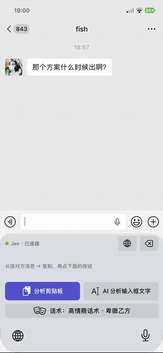
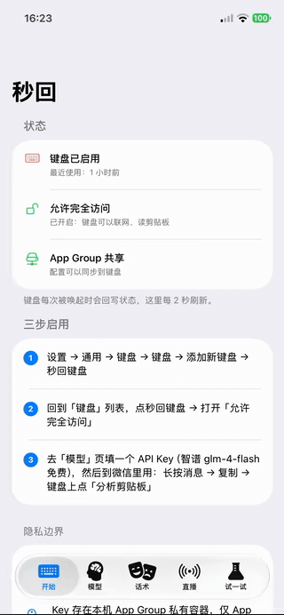

# jev-chat-jarvis (iOS · Keyboard)


[中文](README.md) | English

You receive a message in a chat app → the **intent**, **risk**, and **reply suggestions** appear right on the keyboard inside that app. Tap once and the reply lands in the input field.

No app switching, no background capture, no screen-recording permission — **one custom keyboard that works in every chat app**, in any input field.

<p align="center">
  &nbsp;&nbsp;
  
</p>

The app and keyboard support **Chinese and English**. Switch languages on the **Home** tab of Jev Jarvis; the choice is shared with the keyboard through the App Group and takes effect on its next render.

## Usage

### 1. Install on your iPhone

1. Open `JevJarvis.xcodeproj` on a Mac (Xcode 15+; this repo is verified with Xcode 27)
2. Select the **JevJarvis** target → Signing & Capabilities → choose your Apple ID as the Team (a free personal account works; add it in Xcode → Settings → Accounts)
3. Plug in your iPhone, select it as the run destination, and press `Cmd+R`. On first run, trust the developer certificate on the phone: Settings → General → VPN & Device Management
4. Both targets (**JevJarvis** and **JevKeyboard**) must use the **same Team**, otherwise the App Group sharing breaks

> Signatures from a free personal account expire after 7 days; just `Cmd+R` again to renew.

### 2. Enable the keyboard (on the iPhone)

1. Settings → General → Keyboard → Keyboards → **Add New Keyboard** → pick **Jev Keyboard**
2. Back in the keyboard list, tap **Jev Keyboard** → turn on **Allow Full Access** (required for network + clipboard)
3. Open the Jev Jarvis app → **Models** tab: pick a preset, enter your API key, tap **Test connection**
4. Run one message on the **Try it** tab — if it passes, everything works

### 3. Use it in a chat app

1. Long-press the incoming message → **Copy**
2. Focus the input field, switch to Jev (globe key) → tap **Analyze Clipboard**
3. The keyboard shows: intent + risk 0-9 + suggested actions + 2 candidates per tone (first safe, second bolder)
4. Tap the candidate you like → the text goes straight into the input field → **sending is always manual** (this project never auto-sends)

There is also an **Analyze input text** button for drafts you are unsure about (reads `documentContextBeforeInput`).

## Configuration

Everything is configured inside the app; changes save immediately and the keyboard picks them up without a restart:

- **Generation layer (required)**: choose an OpenAI-compatible (`/chat/completions`) or Anthropic-compatible (`/v1/messages`) service and enter your own API key and model. This project provides **no** generation service or relay. URLs work with or without `/v1`, up to the action segment; extra JSON fields are supported. **Avoid reasoning models** — thinking consumes the whole budget and yields 0 candidates (the error message will name the model).
- **Judge layer (core)**: TypeSafe Jev (systemone endpoint). One call returns an 8-class intent distribution + a 0-9 risk distribution, and ranks the candidates. Presets for TypeSafe direct, OpenRouter, and Vercel AI Gateway are built in; gateway URL, model, and key are all configurable. Without a key the pipeline automatically degrades to blind drafting (candidates only) — a runtime fallback, not a setting.
- **Tones**: up to two active slots on iOS, twelve built-in tones, plus custom ones (descriptions work best as "what the tone is + what to avoid"). One request per tone, two candidates each, requests run concurrently.

### Privacy boundary

- Chat content is sent **only** to the model endpoint **you** configured, at the moment you tap Analyze; no self-hosted server, no storage, no logs
- The API key lives in the private App Group container, readable only by the app and the keyboard
- The keyboard does not monitor or upload keystrokes; Full Access can be revoked or the keyboard removed in system settings at any time

## Regression checks

The `Shared/` directory is the single source of truth shared by the app and the keyboard: intent set, risk scale, action advice, tone library, drafting prompts, candidate cleaning, and URL-joining rules exist only there, so both sides always behave the same.

Run the regression checks on a Mac (no iPhone needed):

```bash
swiftc -o /tmp/jevcheck tools/PromptCheck/main.swift Shared/*.swift && /tmp/jevcheck
```

Unsigned build check (no certificate needed):

```bash
xcodegen generate
xcodebuild -project JevJarvis.xcodeproj -target JevJarvis -sdk iphoneos \
  -destination 'generic/platform=iOS' CODE_SIGNING_ALLOWED=NO build
```

UI regression (launch smoke, tab traversal, keyboard enablement) and App Store screenshot capture live in `UITests/` and run via the `JevJarvis` scheme with an iPhone simulator selected.

## Project structure

```
├── project.yml            # xcodegen project definition (run `xcodegen generate` after edits)
├── AGENTS.md              # repository guidelines (style / commits / security)
├── Shared/                # single source of truth shared by app + keyboard (Foundation only, no UI)
│   ├── JevModel.swift     # config model + App Group storage
│   ├── JevLocalization.swift # Chinese/English copy and intent/risk/action localization
│   ├── JevPrompts.swift   # intents/risk scale/tones/prompts/candidate cleaning
│   ├── JevHTTP.swift      # budgeted POST (429/5xx backoff retry)
│   ├── JevJudge.swift     # TypeSafe systemone: judging + ranking
│   ├── JevDraft.swift     # OpenAI/Anthropic drafting
│   └── JevPipeline.swift  # judge → concurrent per-tone drafting → ranking
├── App/Sources/           # SwiftUI: Home (keyboard status) / Models / Tones / Try it
├── App/Assets.xcassets/   # AppIcon (edit via tools/MakeAppIcon, never the PNGs)
├── Keyboard/Sources/      # UIKit keyboard extension (system controls only, <60MB memory)
├── UITests/               # XCUITest: launch/tab/keyboard regression + store screenshot capture
├── marketing/app-store-upload/  # App Store screenshots (source captures + npm script)
└── tools/
    ├── PromptCheck/       # regression checks
    └── MakeAppIcon/       # renders the AppIcon: swiftc -O -o /tmp/makeappicon tools/MakeAppIcon/main.swift && /tmp/makeappicon App/Assets.xcassets/AppIcon.appiconset
```

## Known limitations

- **Copied messages carry no context**: the clipboard usually holds just that one line. If your chat app supports copying quoted text, the quote rides along; multi-turn context is on the roadmap
- Fixed keyboard height of 320pt; the candidate list scrolls when long; landscape is not adapted
- The App Group requires both targets signed with the same Team; free personal accounts usually work, occasionally a paid account is needed
- Secure inputs (password fields) force the system keyboard (system behavior, not a bug)
- Keyboards signed with a free account expire after 7 days and need a reinstall

## Roadmap

1. **Automatic sensing**: the main app uses ScreenCaptureKit (iOS 26+ `UIBackgroundModes: screen-capture`) to read the screen and analyze, writes candidates into the App Group, and the keyboard panel **proactively displays** ready candidates — sensing and insertion decoupled
2. Full QWERTY inside the keyboard (type without switching)
3. Group-chat adaptation (`@` prefix), knowledge base (contact profiles / standing notes)
4. Scheduled re-signing / TestFlight distribution — the full workflow with a borrowed developer account is in [`docs/TESTFLIGHT.md`](docs/TESTFLIGHT.md)

## License

Copyright © 2026 eatmoreduck, Xlff, and jev-chat contributors. Code is open-sourced under the [MIT](LICENSE) license; see also [NOTICE](NOTICE).

- **Commercial use allowed**: individuals and companies may use, modify, and redistribute without payment or prior authorization
- **Attribution required**: keep `LICENSE` and `NOTICE` when distributing, and state the source
- **Do not** use the names 「秒回」「Jev 聊天助手」「jev-chat」「jev-jarvis-ios」 to imply endorsement by the original authors
- **Legitimate use only**: this project assists your own sincere everyday communication. It must not be used for anything unlawful — including but not limited to fraud (romance/investment scams, elder fraud), impersonation, harassment, or spam marketing
- **Disclaimer**: provided "as is"; the authors are not involved in, aware of, or responsible for any specific usage. It only processes chats on your own device that you are entitled to see, and candidates are only inserted into the input field — **never sent automatically**
- Full risk disclosure: [Usage statement & risk notice](https://github.com/jev-chat/jev-chat-jarvis-ios/issues/2)
